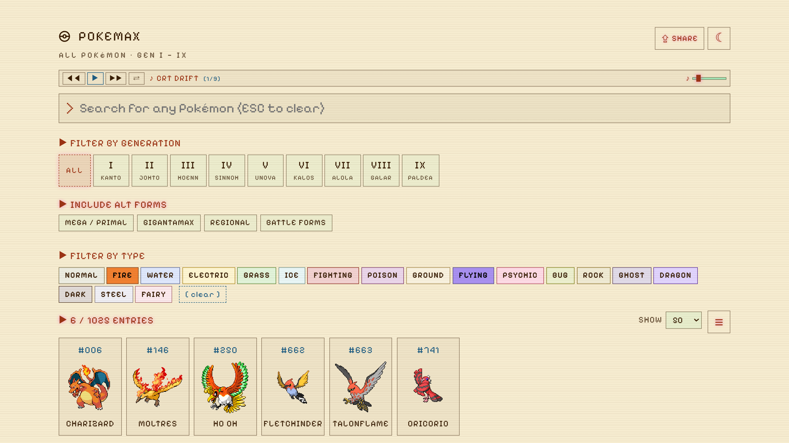
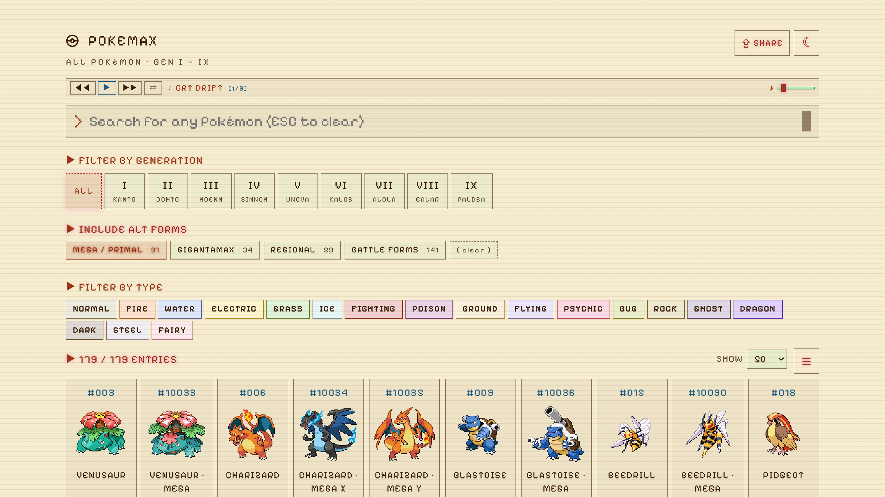

# pokemax

A retro CRT-terminal-styled Pokédex for the whole main series — **all 1,022 species across Gen I → IX**. Browse the dex as a sprite grid, filter by generation or type, page through results, and inspect every stat, ability, evolution, form and move — plus the canonical competitive build sourced live from Smogon.

🔗 **Live:** [codebend3r.github.io/pokemax](https://codebend3r.github.io/pokemax/)

Built with Vite + React 19 + TypeScript. Two themes (phosphor-green CRT and warm parchment), Pixelify Sans bitmap typography, scanline overlay, magenta accents, blinking cursor, a built-in chiptune player and per-Pokémon cry playback.

---

## Screenshots

### Home · grid + filters

The full dex renders below the search bar with generation, alt-form and type filter rows. Typing instantly narrows the visible set; Enter jumps straight to a card. Hovering a cell swaps the static pixel sprite for the animated showdown sprite.


### Multi-type filter

Click any combination of type chips to find every species that matches **all** selected types. Below, `FIRE + FLYING` surfaces Charizard, Moltres, Ho-Oh and friends.



### Pokémon card

Click any cell (or hit Enter in the search bar) to open the full card: official artwork with `2D ⇄ 3D` toggle, `NORMAL ⇄ SHINY` toggle, click-to-play cry with volume slider, color-coded type chips, height/weight, alternate forms picker (Mega X/Y, Gmax, regional variants, battle forms), Pokédex flavor text grouped by version, base stats with bar graphs, abilities (hidden ability marked), full branching evolution chain, every move learned in that generation's canonical version pair grouped by learn method, and a Smogon competitive build with tier, item, ability, nature, EVs and moves.


### Click any type chip for matchups

Each colored type chip is clickable. Expands inline to show that type's offensive matchups (super effective vs / not very effective vs / no effect) and defensive matchups (weak to / resists / immune).


### Alt forms

Mega/Primal, Gigantamax, regional variants and battle forms aren't fetched by default — toggle a chip and the relevant forms get pulled in and interleaved next to their base species in the grid.



### Mobile

The whole layout is responsive. Card top stacks, stat bars compress, type chips wrap, move list collapses to a single column.

| Mobile · home | Mobile · card |
|:--:|:--:|
|  |  |

---

## Features

- **Full national dex** — every species from Bulbasaur through the Gen IX additions, ordered by Pokédex number
- **Generation filter** — toggle any subset of `I` through `IX` (multi-select; empty = all)
- **Multi-type filter** — pick one or more of the 18 types; cells are shown only if they match **every** selected type
- **Alt-form chips** — opt-in fetches for `MEGA / PRIMAL`, `GIGANTAMAX`, `REGIONAL`, and other `BATTLE FORMS`; forms render inline next to their base species
- **Live search** — typing filters the visible grid in real time; Enter jumps to the first match; Esc clears
- **Pagination + view mode** — choose page size (30/60/120/all) and toggle between sprite-grid and compact list view; settings persist
- **Hover-animated sprites** — flat 2D pixel sprite by default; on hover, the animated Black/White or Showdown GIF plays. Only the hovered cell animates.
- **Pokémon card** with collapsible sections:
  - All six base stats as bar graphs
  - Abilities, hidden ability marked
  - Branching evolution chain with conditions (Toxel → Toxtricity Amped/Low Key, Applin → Flapple/Appletun, eevee → 8 evolutions, etc.) — every node clickable to jump
  - Pokédex flavor text deduplicated and grouped by version
  - Every move available in that generation's canonical version pair, grouped by learn method
  - Smogon competitive build (tier, item, ability, nature, EVs, moves) — fetched live from `pkmn.github.io`, generation-aware
  - In-card **form switcher** (e.g. Charizard ⇆ Mega X ⇆ Mega Y ⇆ Gmax)
  - **Compare** button to diff base stats against another species side-by-side
- **Click for details** — moves, abilities, items, natures and types are all clickable; each expands inline
- **2D / 3D sprite toggle** — flat pixel art ↔ animated Showdown rendering (with Pokémon HOME / official-artwork fallbacks)
- **Shiny toggle** — official-artwork shiny variant with graceful fallback to pixel shiny
- **Click-to-play cry** — every Pokémon's cry plays from the card sprite, with a volume slider
- **Built-in chiptune player** — Web Audio synthesizes a small NES-style playlist; play/pause/skip and volume controls in the header
- **Two themes** — dark phosphor CRT and a light parchment theme; persisted to `localStorage`
- **Share button** — copies a deep-link URL like `?p=charizard` that opens the app directly to that card
- **CRT aesthetic** — Pixelify Sans, scanline overlay, power-on flash, blinking cursor, color-coded type chips
- **Mobile responsive** — single-column card, compressed stats, wrapping chips
- **Accessible** — keyboard navigation, ARIA roles, focus rings on tab-only

---

## Tech stack

- **Vite 6** + **React 19** + **TypeScript** (strict)
- **Plain CSS** — no Tailwind, no styled-components; one `crt.css` file with CSS variables and media queries
- **Native `fetch`** — no Axios or similar
- **Web Audio API** — chiptune synthesis, no audio files in the bundle
- **Vitest** + **@testing-library/react** + **jsdom** for tests
- **Pixelify Sans** Google Font
- **ESLint + Husky pre-commit** keep the tree lint-clean
- **Data sources:**
  - [PokeAPI](https://pokeapi.co) — species, stats, abilities, evolutions, moves, sprites, cries
  - [Smogon sets via pkmn.github.io](https://pkmn.github.io) — competitive builds per generation
  - [PokeAPI sprites repo](https://github.com/PokeAPI/sprites) — pixel + animated Black/White + Showdown GIFs + official artwork

---

## Run it

```bash
npm install
npm run dev      # vite dev server
```

Pass `--host` to expose on your LAN (great for testing on a phone):

```bash
npm run dev -- --host
```

## Test

```bash
npm test         # vitest run
```

## Build

```bash
npm run build    # production bundle to dist/
```

---

## Project layout

```
src/
├── App.tsx                    # top-level orchestration
├── api.ts                     # PokeAPI fetch helpers
├── competitive.ts             # Smogon set fetcher, picks the best build per gen
├── moves.ts                   # group & sort moves by learn method
├── music.ts                   # Web Audio chiptune player
├── typeChart.ts               # static 18-type effectiveness matrix
├── generations.ts             # Gen I–IX metadata (region, version groups)
├── types.ts                   # API response types
├── textUtil.ts                # flavor-text + audio scaling helpers
├── hooks/
│   ├── useAllSpecies.ts       # full dex index (cached)
│   ├── useExtraForms.ts       # lazy fetch for mega/gmax/regional/etc.
│   ├── usePokemon.ts          # parallel pokemon + species + chain fetch
│   ├── useCompetitiveSet.ts   # Smogon set lookup
│   ├── useApiDetail.ts        # generic /endpoint/{name} cache for click-to-detail
│   ├── useTypeIndex.ts        # type-by-id index (lazy)
│   ├── useTheme.ts            # dark/light theme persistence
│   ├── useViewMode.ts         # grid/list persistence
│   ├── usePageSize.ts         # page-size persistence
│   └── useVolume.ts           # music + cry volume persistence
├── components/
│   ├── PokemonGrid.tsx        # browseable, paginated, type-filtered grid
│   ├── SearchBar.tsx          # controlled input with Enter/Escape
│   ├── PokemonCard.tsx        # composes every card section
│   ├── ComparePanel.tsx       # stat-vs-stat comparison
│   ├── FormSwitcher.tsx       # in-card variety picker
│   ├── GenFilter.tsx          # Gen I–IX chips
│   ├── TypeFilter.tsx         # 18-type chip row
│   ├── ViewModeToggle.tsx     # grid ⇄ list
│   ├── PageSizeSelector.tsx
│   ├── Pagination.tsx
│   ├── ThemeToggle.tsx
│   ├── ShareButton.tsx        # copies deeplink URL
│   ├── MusicPlayer.tsx        # chiptune transport
│   ├── StatBar.tsx
│   ├── AbilityList.tsx
│   ├── EvolutionChain.tsx     # recursive renderer, supports branches
│   ├── MoveList.tsx
│   ├── CompetitiveBuild.tsx   # Smogon set renderer
│   ├── Detail.tsx             # generic click-for-detail expander
│   ├── TypeMatchup.tsx        # offensive + defensive matchup grid
│   ├── ShinyToggle.tsx
│   ├── SpriteToggle.tsx       # 2D ⇄ 3D
│   ├── StatusLine.tsx         # [READY] / [SCANNING…] / [ERR …]
│   └── Section.tsx            # collapsible <details>-based wrapper
├── styles/crt.css             # the entire retro theme (both light + dark)
└── __tests__/                 # Vitest tests
docs/screenshots/              # the screenshots embedded in this README
scripts/screenshot.mjs         # Playwright script that produced them
```

## Re-generating the screenshots

```bash
npm run dev &                                    # in one shell
npx playwright install chromium                  # one-time
node scripts/screenshot.mjs                      # writes to docs/screenshots/
```

The script clips to the viewport (no `fullPage: true`) so README images stay landscape-shaped. Tweak the viewports at the top of `scripts/screenshot.mjs` if you want a different aspect.

---

## Credits

- **PokeAPI** for the data backend (species, moves, abilities, sprites, cries)
- **Smogon University** + **pkmn.cc** for competitive analyses per generation
- **Pokémon HOME** team for the 3D renders
- **Pokémon Showdown** for the animated pixel sprites
- **Pixelify Sans** font by Stefie Justprince
